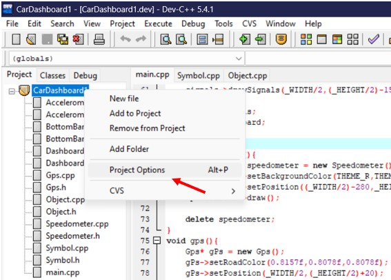
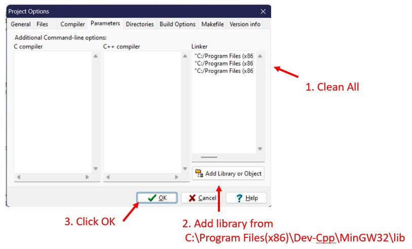

# CarDashboard_OpenGL
 This is the dashboard drawn using OpenGL
 
 ## Output

## Prerequisite
If you need a programming environment, please follow the steps below. 
Otherwise just run the .exe program

## Pre-installation
- OpenGL only works on Dev-Cpp 5.4.1.

### Setup Dev-Cpp 5.4.1
- Go to setup folder.
- Run "Dev-Cpp 5.4.1 MinGW 4.7.2 Setup.exe" file to install the Dev-Cpp.

### Setup OpenGL toolkit
1. Cut glut32.dll file and paste it to "C:\Windows\SysWOW64".
2. Cut glut.h file and paste it to "C:\Program Files(x86)\Dev-Cpp\MinGW32\include\GL".
3. Cut libopengl32.a, libglu32.a, libglut32.a and paste it to "C:\Program Files(x86)\Dev-Cpp\MinGW32\lib".
4. Link project file with the following files.libopengl32.alibglu32.alibglut32.a

### In Dev-Cpp
Link project file with the following files.
- libopengl32.a
- libglu32.a
- libglut32.a
 
#### Step1 Right Click, select Project option
 
 
#### Step2
 

After completing the above steps you will be able to edit and run the program.\
Good Luck.

Regards, \
SsS651
